# 📉 Telco Customer Churn — End-to-End ML System

[](https://github.com/Mnabil-11/telco-customer-churn/actions/workflows/ci.yml)
[](https://www.python.org/)
[](https://fastapi.tiangolo.com/)
[](https://www.docker.com/)
[](https://shap.readthedocs.io/)

A production-minded churn prediction system — not a single notebook, but a
full pipeline: **SQL-backed exploration → an honestly-compared model
selection → a business-derived decision threshold → SHAP-explained,
tested, containerized, CI-verified serving.**

📄 **[Read the full Model Card](./MODEL_CARD.md)** — model comparison,
class-imbalance rationale, threshold derivation, SHAP analysis, and a
documented production bug caught by the test suite before it shipped.

---

## Why this isn't "just another churn notebook"

Search GitHub for "telco churn" and you'll find hundreds of notebooks that
stop at a confusion matrix. This project asks the harder questions:

| Question most churn projects skip | How this one answers it |
|---|---|
| *Is the fancier model actually better?* | XGBoost and Random Forest were tried — both **overfit** (16–21% train/test gap). Logistic Regression won on every Churn-class metric *and* generalized best. See [Model Comparison](#model-comparison). |
| *Is 0.5 the right decision threshold?* | No. A real cost-benefit model puts the profit-maximizing threshold at **~0.05** — at which Recall jumps from 55% to **98.4%** (catching 368 of 374 actual churners), verified across four sensitivity scenarios, not just asserted. |
| *Can you explain a single prediction, or just the model overall?* | `POST /explain` returns per-feature SHAP contributions for that exact customer, not just global feature importance. |
| *Does the API actually work correctly, or just the notebook?* | A unit test caught a live encoding bug that silently corrupted single-request predictions (**29.0% → 64.9%** for the same customer, pre/post fix) — documented, not hidden. See [The Bug](#the-bug-a-unit-test-earned-its-keep). |
| *Is the pipeline reproducible, or "works on my machine"?* | `tests/test_pipeline.py` runs the entire `src/*.py` pipeline end-to-end against synthetic data, and CI runs a full Docker build + smoke test on every push. |

---

## Architecture

```mermaid
flowchart LR
    CSV[Kaggle CSV<br/>7,043 customers] -->|csv_to_sqlite.py| DB[(SQLite<br/>churn.db)]
    DB -->|clean_data.py| Clean[customers_clean]
    Clean -->|eda_visual.py<br/>eda_categorical.py| EDA[EDA figures]
    Clean -->|feature_engineering.py| Feat[features table]
    Feat -->|train_models.py| Models{3 classifiers<br/>compared}
    Models -->|evaluate_models.py| Eval[Confusion matrices<br/>Precision/Recall/F1]
    Eval -->|business_framing.py| Biz[Cost-benefit model<br/>optimal threshold]
    Biz -->|sensitivity_analysis.py| Sens[Robustness check<br/>4 scenarios]
    Sens -->|train_final_model.py| Final[Final model<br/>100% of data]
    Final -->|shap_analysis.py| SHAP[Global + local<br/>SHAP importance]
    Final --> API[FastAPI<br/>/predict + /explain]
    API --> Docker[Docker / Compose]
    API -.->|test_api.py| T1[API tests]
    Feat -.->|test_pipeline.py| T2[Full pipeline test]

    style Models fill:#2d3748,color:#fff
    style Biz fill:#2d3748,color:#fff
    style API fill:#009688,color:#fff
    style SHAP fill:#8A2BE2,color:#fff
```



**Why SQL instead of loading the CSV directly into Pandas:** the dataset is
loaded into SQLite first (`data/churn.db`) so the exploration phase
practices real query-based analysis — the kind of access pattern used
against a production database — rather than defaulting straight to
`pd.read_csv()`.

---

## Model Comparison

All three models trained on an identical 80/20 stratified split:

| Model | Train Acc. | Test Acc. | Overfitting Gap | Precision (Churn) | Recall (Churn) | F1 (Churn) |
|---|---|---|---|---|---|---|
| **Logistic Regression ✅** | 80.53% | **79.77%** | **0.76%** | **0.64** | **0.55** | **0.59** |
| Random Forest | 99.79% | 78.28% | 21.51% | 0.62 | 0.48 | 0.54 |
| XGBoost | 93.70% | 77.43% | 16.27% | 0.59 | 0.51 | 0.54 |

Logistic Regression wins not on raw accuracy alone, but because it
**generalizes** — the tree ensembles memorize training noise rather than
transferable patterns on this dataset — and it wins on every Churn-class
metric. Its coefficients are also directly inspectable, which is what
first surfaced the encoding bug below during manual testing.

> Full rationale — including why `class_weight='balanced'` and SMOTE were
> deliberately **not** used — is in the [Model Card](./MODEL_CARD.md#how-class-imbalance-was-handled).

---

## The Bug: A Unit Test Earned Its Keep

`encode_customer` used `pd.get_dummies(..., drop_first=True)` on a
**single-row** request. With only one row, pandas has only one category to
see per column — so it silently treated that one value as the training
baseline and zeroed it out, regardless of what it actually was.

**Concretely:** a customer with `InternetService="Fiber optic"` and
`PaymentMethod="Electronic check"` had both encoded as if they were
`DSL` and `Bank transfer (automatic)` — the real training baselines —
producing a churn probability of **29.0%** instead of the correct **64.9%**.

This was caught by `tests/test_api.py`, not by manual inspection. The fix:
nominal columns are now cast to `pd.Categorical` with the exact
training-time category list before encoding, so a single request always
produces the same columns regardless of which value it holds. Full
write-up in the [Model Card](./MODEL_CARD.md#known-failure-modes--limitations).

---

## Key Findings

- **Baseline churn rate:** 26.54%
- **Strongest churn drivers:** `Contract` (Month-to-month 42.7% vs. Two-year
  2.8%), `InternetService = Fiber optic` (41.9%), low `tenure`, missing
  `TechSupport`/`OnlineSecurity`, `PaymentMethod = Electronic check`
- **At the ML-conventional 0.5 threshold**, Recall on churners is only 55%
  — the model misses ~45% of customers who actually churn. **This is
  exactly why 0.5 isn't used as the real operating threshold**: a missed
  churner is a customer never even offered retention, which the business
  framing below shows is far costlier than an unnecessary offer.
- **At the business-optimal threshold (~0.05):** Recall jumps to **98.4%**
  (catching 368 of 374 actual churners), at the cost of more false
  alarms — see the [Model Card](./MODEL_CARD.md) for the full metrics
  table at this threshold.
- **Business framing:** given retention-offer economics (offer cost ≈ 20%
  of `MonthlyCharges`, 30% success rate, 12 months of retained revenue if
  saved), broad targeting is economically optimal — and this holds even
  under pessimistic cost/success assumptions in the sensitivity analysis.

---

## Project Structure

```
data/               Raw CSV + SQLite database (not committed)
notebooks/figures/  Saved plots: EDA, confusion matrices, SHAP, business analysis
models/             Persisted final model artifacts (joblib)
src/                Pipeline scripts, run in order (see below)
app/                FastAPI serving app (/predict, /explain)
tests/              test_api.py (caught the encoding bug) + test_pipeline.py (full e2e)
```

---

## Running the Full Pipeline

```bash
python -m venv venv
./venv/Scripts/pip install -r requirements.txt   # Windows
# source venv/bin/activate && pip install -r requirements.txt   # macOS/Linux

python src/csv_to_sqlite.py        # CSV -> SQLite table `customers`
python src/clean_data.py           # cleans TotalCharges -> `customers_clean`
python src/eda_visual.py           # numeric distributions + boxplots by churn
python src/eda_categorical.py      # churn rate by categorical variable
python src/feature_engineering.py  # encoding -> `features` table
python src/train_models.py         # trains & compares 3 classifiers
python src/evaluate_models.py      # confusion matrices, precision/recall/F1
python src/business_framing.py     # cost-benefit, threshold tuning
python src/sensitivity_analysis.py # stress-tests the business assumptions
python src/train_final_model.py    # retrains on 100% of data, saves to models/
python src/shap_analysis.py        # SHAP global importance + example explanations
```

---

## Running the API

```bash
./venv/Scripts/python.exe -m uvicorn app.main:app --port 8000
```

```bash
curl -X POST "http://127.0.0.1:8000/predict" \
  -H "Content-Type: application/json" \
  -d '{
    "gender": "Female", "SeniorCitizen": 0, "Partner": "No", "Dependents": "No",
    "tenure": 2, "PhoneService": "Yes", "MultipleLines": "No",
    "InternetService": "Fiber optic", "OnlineSecurity": "No", "OnlineBackup": "No",
    "DeviceProtection": "No", "TechSupport": "No", "StreamingTV": "No", "StreamingMovies": "No",
    "Contract": "Month-to-month", "PaperlessBilling": "Yes",
    "PaymentMethod": "Electronic check", "MonthlyCharges": 85.0
  }'
```

```json
{"churn_probability": 0.65, "churn_prediction": true, "threshold_used": 0.5}
```

Pass `?threshold=0.05` to use the business-optimal cutoff from the
sensitivity analysis instead of the default 0.5.

### Explaining a prediction (SHAP)

`POST /explain` takes the same payload and returns **why** — every
feature's SHAP contribution plus the model's base value, sorted by
magnitude:

```bash
curl -X POST "http://127.0.0.1:8000/explain?top_n=5" \
  -H "Content-Type: application/json" \
  -d '{ ...same fields as /predict... }'
```

```json
{
  "churn_probability": 0.6489,
  "base_value": -1.5256,
  "contributions": [
    {"feature": "tenure", "shap_value": 0.997},
    {"feature": "InternetService_Fiber optic", "shap_value": 0.632},
    {"feature": "Contract_Two year", "shap_value": 0.283},
    {"feature": "MonthlyCharges", "shap_value": -0.268},
    {"feature": "PaymentMethod_Electronic check", "shap_value": 0.196}
  ]
}
```

`base_value + sum(contributions) == logit(churn_probability)`, always —
see the [Model Card](./MODEL_CARD.md)'s "Model Interpretability (SHAP)"
section for the full global/local analysis and figures.

---

## Running with Docker

```bash
docker build -t telco-churn-api .
docker run -d -p 8000:8000 --name telco-churn-api telco-churn-api
```

The image only bundles `app/`, `models/`, and `requirements-api.txt` — a
lighter dependency set than the full training pipeline needs. Same
`/health`, `/predict`, and `/explain` endpoints, now served from the
container.

### Or with Docker Compose

```bash
docker compose up -d --build
```

Equivalent, but also adds a healthcheck (`docker compose ps` shows
`healthy`) and `restart: unless-stopped`. See `docker-compose.yml`.

---

## Running Tests

```bash
./venv/Scripts/pip install -r requirements-dev.txt
./venv/Scripts/python.exe -m pytest tests/ -v
```

- **`tests/test_api.py`** — `/health`, `/predict`, `/explain` (happy path,
  threshold behavior, all input validation bounds), and `encode_customer`
  in isolation — the exact test that caught the encoding bug above.
- **`tests/test_pipeline.py`** — runs the entire `src/*.py` pipeline
  end-to-end against a small synthetic dataset, so a change that breaks
  the training pipeline (not just the API) is caught too.

---

## CI

[`.github/workflows/ci.yml`](.github/workflows/ci.yml) runs the full test
suite **and** a Docker build + smoke test on every push/PR to `master`.
Both badges at the top of this README are live status, not screenshots.

---

## Dataset

[Telco Customer Churn](https://www.kaggle.com/datasets/blastchar/telco-customer-churn)
(Kaggle) — 7,043 customers, 21 columns.

---

## Further Reading

📄 **[MODEL_CARD.md](./MODEL_CARD.md)** — the full technical writeup:
model selection reasoning, class-imbalance handling, decision-threshold
derivation, SHAP interpretability, known failure modes, and
recommendations for future work.
